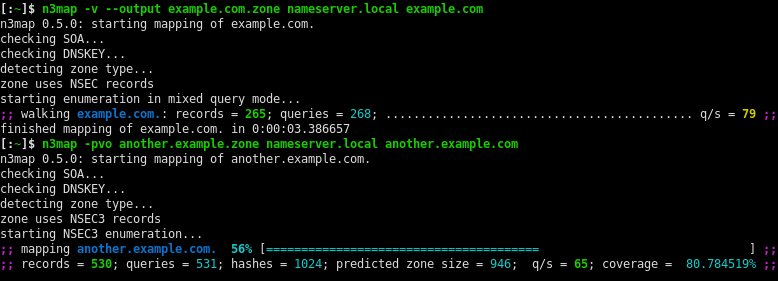

nsec3map - DNSSEC Zone Enumerator
=================================

`n3map` is a tool that can enumerate DNS zone entries based on DNSSEC
[NSEC][NSEC] or [NSEC3][NSEC3] record chains.  It can be used to discover hosts
in a DNS zone quickly and with a minimum amount of queries if said zone is
DNSSEC-enabled.

`n3map` was written primarily to show that NSEC3 does not offer meaningful
protection against zone enumeration.
Although originally only intended as a PoC and written in Python, it is
actually quite fast and able to enumerate even large zones (with a million or
more entries) in a short time given adequate hardware.

It also includes a simple [John the Ripper][JtR] plugin that can be used to crack the
obtained NSEC3 hashes.

Usage Examples
--------------

Some typical usage examples are shown below. For a more detailed documentation,
refer to the man pages or the output of `n3map --help`.

### NSEC Zone Walking

The most basic example is to enumerate a particular zone (e.g. example.com) and
store the retrieved NSEC/NSEC3 records in a file example.com.zone:

	$ n3map -v -o example.com.zone example.com
	n3map 0.4.0: starting mapping of example.com
	looking up nameservers for zone example.com.
	using nameserver: 199.43.133.53:53 (b.iana-servers.net.)
	using nameserver: 199.43.132.53:53 (a.iana-servers.net.)
	checking SOA...
	detecting zone type...
	zone uses NSEC records
	starting enumeration in mixed query mode...
	discovered owner: example.com.	A NS SOA TXT AAAA RRSIG NSEC DNSKEY
	discovered owner: www.example.com.	A TXT AAAA RRSIG NSEC
	;; walking example.com.: records =   2; queries =   4; ............. q/s = 11 ;;
	finished mapping of example.com. in 0:00:00.196471

The `-v` switch is only used for more verbosity and not generally needed. With
no further arguments, `nsec3map` detects automatically whether the zone uses
NSEC or NSEC3 and uses the corresponding enumeration method. It also looks up
the zone's nameservers by itself.

Some nameservers do not accept NSEC queries. In such a case, `--query-mode A`
(short `-A`) can be used instead. For example, to enumerate the root zone, one
could run the command:

	n3map -v -A --output root.zone  .

#### Avoiding Sub-Zones

Note that the above command will likely print a lot of warnings about sub-zones
(children of the zone that we want to enumerate). `n3map` tries its best to
avoid descending into sub-zones and instead tries to jump over them
automatically.
If you wish to avoid most of these warnings, you can tell `n3map` to never add
prefix labels to the queries it sends using the `--no-prefix-labels` option.
For example:

    n3map -vA --no-prefix-labels -o root.zone .

This option is particularly useful to enumerate top-level domain (TLD) zones.
Note however that using it can sometimes lead to a less complete enumeration
for zones with nested subdomains.

Alternatively, you can try to find nameservers that respond to
direct NSEC queries (find them e.g. by trying `--query-mode=NSEC`) and tell
`n3map` to only use those:

    n3map -vo example.com.zone goodns{1,2}.example.com example.com

### NSEC3 Zone Enumeration

The following example shows the enumeration of a NSEC3 chain at example.com
using a nameserver at 192.168.1.37. It also shows the NSEC3 zone size
prediction and progress indicator (enabled using the `-p` switch).

	$ n3map -3po example.com.zone 192.168.1.37 example.com
	;; mapping example.com.: 79% [===========================================================================                   ] ;;
	;; records = 797; queries = 802; hashes = 3840; predicted zone size = 1003; ............... q/s = 513; coverage =  95.677595% ;;
	
	received SIGINT, terminating

Note that the enumeration will proceed slower towards the end as it becomes
harder to find domain names that are not covered by any retrieved NSEC3
records. Therefore, finishing the enumeration of a large zone can take quite
some time and computing resources. It is advisable to manually cancel the
enumeration once the query rate drops under a certain limit.

You should also make use of the `--limit-rate` option to reduce stress on the
nameservers. If you think the enumeration is too slow because of a high
round-trip time to the nameservers, you can also use a more aggressive mode
which sends multiple queries simultaneously (`--aggressive` option). The
following example shows how to use these options:

	n3map -3pvo example.com.zone --aggressive 16 --limit-rate 100/s example.com

This will cause nsec3map to send a maximum of 16 queries in parallel while at
the same time keeping the query rate at or below roughly 100 queries per
second.

It is also possible to continue the enumeration from a partially obtained NSEC3
(or NSEC) chain, as long as the zone's NSEC3 parameters (salt, iteration count)
have not been changed:

	n3map -3pv --input example.com.partial --output example.com.zone --ignore-overlapping example.com

This will first read the NSEC3 records from example.com.partial and then
continue the enumeration, saving the NSEC3 chain to example.com.zone.
The `--ignore-overlapping` option should be used for large zones, or if it is
otherwise likely that changes are made to the zone during the enumeration.  If
specified, nsec3map will not abort the enumeration when it receives an NSEC3
record which overlaps with another record that was received earlier. Note
however that you will not get a completely consistent view of the NSEC3 chain
if you use this option.

### Cracking NSEC3 Hashes

Once you obtained some NSEC3 records from a particular zone, you can (try to)
crack them using John the Ripper and the supplied NSEC3 patch (see *John the
Ripper Plugin* below on how to install it).

First, the NSEC3 records need to be converted to a different format used by the
JtR patch:

	n3map-johnify example.com.zone example.com.john

The records can then be cracked simply by running  `john` on the resulting file:

	john example.com.john

Refer to the JtR documentation for more information on how to make use of
john's different cracking modes, wordlist rules and so on. It is probably a
good idea to adapt the wordlist and mangling rules to the kind of zone you are
trying to map.

You can also try to crack NSEC3 records using [hashcat][hashcat],
using hashes converted to a slightly different format:

	n3map-hashcatify example.com.zone example.com.hashcat

The records can then be cracked simply by running `hashcat` on the resulting file:

	hashcat -m 8300 example.com.hashcat

Installation
------------

### From PyPI

The PyPI package still needs to compile the C extension module for faster hashing,
which means you need a C compiler as well as the necessary header files for
Python and libcrypto (OpenSSL) installed.

For Debian-based systems:

    sudo apt-get install python3 python3-pip python3-dev gcc libssl3 libssl-dev

To then install nsec3map from PyPI, simply run:

    python3 -m pip install n3map[predict]

If you do not care about NSEC3 zone size prediction and don't want
numpy and scipy installed, you can use:

    python3 -m pip install n3map

#### Installing into a Virtual Environment

It may be advisable to install n3map into a Python venv, especially if you are
faced with any dependency problems:

    mkdir venv
    python3 -m venv venv
    source venv/bin/activate
    python3 -m pip install n3map[predict]

More conveniently, you can also use [pipx](https://github.com/pypa/pipx):

    pipx install n3map[predict]

Note that you still need libssl, libssl-dev, gcc and python3-dev.

### From Git Repository

Dependencies:

  * Python >= 3.9
  * dnspython >= 2.0
  * OpenSSL (libcrypto) >= 3.0.0
  * Optionally numpy and scipy for zone size prediction (recommended)

Additionally, pip, setuptools and GCC (for the extension module) are required
during setup.

On a Debian system, just run

	sudo apt-get install python3 python3-dev gcc python3-pip \
         python3-setuptools python3-dnspython libssl3 libssl-dev \
         python3-numpy python3-scipy

Installation:

After cloning the repositry / unpacking the tarball, cd into the project
directory and run:

	python3 -m pip install .[predict]

This will compile the extension modules(s) and install the scripts, python
modules as well as the man pages.
It will make a user install if you are not root.

If you do not care about NSEC3 zone size prediction and don't want
numpy and scipy installed, you can use:

	python3 -m pip install .

Alternatively, you can install it w/o pip:

	sudo python3 setup.py install

#### Running directly from Source Directory

Alternatively, you can also run nsec3map directly from the source directory
without installing it:

    ./n3map.py [options]

If you want to use OpenSSL accelerated
hashing however, you still need to build the extension module:

	python3 setup.py build_ext

This should compile a shared object nsec3hash.so in the build/ directory. You
can then copy this file to the n3map/ directory.

### John the Ripper Plugin

**Update**: The latest version of [John the Ripper jumbo][JtR] includes the NSEC3
cracking patch from this project. There is no need to install it separately,
just follow the build instructions for JtR-Jumbo. Using the latest source
version is recommended.

Alternatively, you can also use [hashcat][hashcat].

Docker
--------

Building the docker container.

	docker build -t nsec3map .

Running n3map or e.g. n3map-hashcatify:

	docker run -it --rm -v "${PWD}:/host" nsec3map -v -o example.com.zone example.com
	docker run -it --entrypoint n3map-hashcatify --rm -v "${PWD}:/host" nsec3map example.com.zone example.com.hashcat

Limitations
-----------

* Many DNS errors are not handled correctly
* No automatic parallelization of NSEC walking (though it is possible to do this manually by partitioning the namespace)
* High memory usage (mostly as a result of using CPython)
* ...

(remember that nsec3map is still mostly a PoC tool...)

[NSEC]: https://www.ietf.org/rfc/rfc4034.txt "Resource Records for the DNS Security Extensions"
[NSEC3]: https://www.ietf.org/rfc/rfc5155.txt "DNS Security (DNSSEC) Hashed Authenticated Denial of Existence"
[JtR]: https://github.com/openwall/john "John the Ripper (Jumbo)"
[hashcat]: https://hashcat.net/hashcat/ "hashcat"
